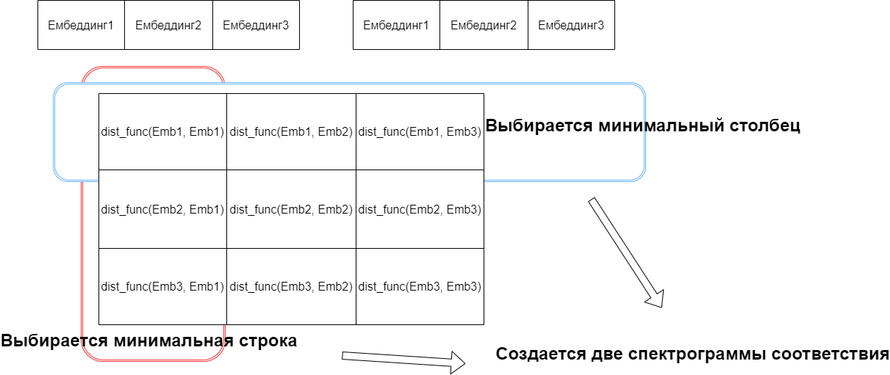
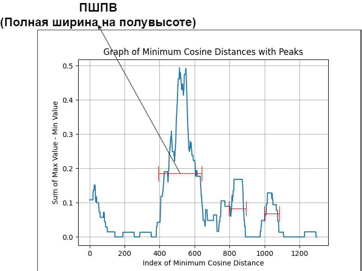

# LCT-pirate-detection
Хакатон "Лидеры Цифровой Трансформации" 
## Сервис проверки видеофайлов на нарушение авторских прав
## Команда
- Легоньков Роман
- Шерри Георгий 
- Деев Леонид
- Парфёнов Егор
- Комолов Тимур
## Запуск приложения
### Запуск ML сервиса
Создать директорию _models_, закинуть в неё веса модели VIT под названием vit_weights.pth, скачав по ссылке: https://drive.google.com/drive/folders/1MMlg4lYux8ltx0iAdRuX68ETHgQeP1_7?usp=sharing
Затем вписать команду в консоль:
```
docker build -t image_ml -f Dockerfile .
```
### Запуск и документация клиентского приложения
[Клиентское приложение](frontend_readme.md)
### Запуск и документация Backend
[Серверное приложение](backend_readme.md)
## Описание решения
Решение задачи по обнаружению пиратства в видеофайлах представляет собой сервис, который позволяет проверить видеофайл
на наличие лицензионного контента. На клиентской стороне пользователь загружает видеофайл, который отправляется на сервер.
На сервере видеофайл сохраняется в отдельную базу данных и отправляется в сервис с машинным обучением.

## Сервис с машинным обучением

### Сравнительная таблица ViT, ResNet, сверточная сиамская модель для создания слепков видеоконтента
|   | ViT  | ResNet | Сиамская модель |
| ------------ | ------------ | ------------ | ------------ |
| Описание   | Модель глубокого обучения, использующая трансформеры для обработки изображений путем разбиения изображения на патчи и кодировании их векторами, достигая высокой точности в задачах компьютерного зрения.  | Модель глубокого обучения, в которой используются блоки с пропуском (skip connections), позволяющие эффективно обучать глубокие нейронные сети, преодолевая проблему затухания градиента | Комплекс из двух моделей, обученных на интервалах с взаимствованиями из изначального датасета |
| Требования к памяти  | vRAM: 8 Gb (inference) | vRAM: <=1 Gb (inference) | vRAM: <=1 Gb (inference) |
| Скорость работы  | Быстро | Быстро | Очень быстро |
| Потенциал к масштабированию  | Очень высокий | Высокий | Высокий |

### Сравнительная таблица PANNS и использование спектрограммы для создания слепков аудиоконтента
|   | PANNS | Спектрограмма |
| ------------ | ------------ | ------------ |
| Описание   | Модель для распознавания звуков, использующий псевдо-внимание и обучение на зашумленных данных для улучшения производительности в условиях ограниченной разметки  | Представление звукового сигнала в частотно-временном представлении, определяющее распределение частотной составляющей аудио сигнала во времени |
| Требования к памяти  | vRAM: ~5 Gb (inference) | RAM: <=1 Gb |
| Скорость работы  | Средне | Быстро |
| Потенциал к масштабированию  | Очень высокий | Средний |

В сервисе построена векторная база данных лицензионных видеофайлов. Каждое видео представлено в виде двух векторов: 
вектора видео и вектора аудио.
Вектор видео получен с помощью модели Vision Transformer (ViT) (!!!), а вектор аудио с помощью модели PANNS 
(PANNS: Large-Scale Pretrained Audio Neural Networks for Audio Pattern Recognition).
Эмбеддинги сохраняются в базе данных LanceDB. 


## Процесс работы сервиса
После того, как видеофайл передаётся в сервис, из него извлекаются вектора видео и аудио по 10 секундным сегментам из исходного видеофайла, при этом для видео обрабатывается 1 кадр в секунду. 
Далее, вычисляется косинусное расстояние между векторами видео и аудио загруженного видеофайла и векторами 
лицензионных видеофайлов и осуществляется поиск по векторной базе данных (!!!), находится наиболее похожее видео.
Затем осуществляется сравнение по кадрам в найденном видео и в загруженном. Между массивами эмбеддингов лицензионного и 
пиратского видео вычисляется косинусное расстояние и записи о косинусном расстоянии формируют матрицу схожести. 



Далее по строкам матрицы схожести вычисляется спектр схожести первого видео со вторым, а по столбцам вычисляется процент схожести 
второго видео с первым. На спектрах ищутся максимальные пики схожести и по ним вычисляются интервалы заимствования видео.



Изначально мы хотели использовать результаты из репозитория и соответствующей статьи [deepiracy](https://github.com/toxtli/deepiracy), предлагающие использовать метод Longest Common Subsequence для поиска интервалов заимствований вместе с нейронными сетями для теггирования видео. Но такой подход был признан менее эффективным, так как для него нужно качественно теггировать объекты на видео, а теггирование могло привести к потере информации. Вместо этого мы решили использовать схожий метод описаный выше, но учитывающий полную информацию о кадре. 

### Сравнительный анализ решений по поиску
|   | Косинусное расстояние  | Сиамская модель |
| ------------ | ------------ | ------------ |
| Описание   | Производит поиск схожести по векторной бд посредством вычисления косинусного расстояния между векторами  | Комплекс из двух моделей, обученных на интервалах с взаимствованиями из изначального датасета |
| Требования к памяти  | Менее 10гб RAM   | Около 40гб RAM   |
| Скорость работы  | Медленно  | Медленно   |
| Потенциал к масштабированию  | Низкий   | Средний  |
| Качество работы  | С косинусным расстоянием фрагменты заимствований определялись хорошо  | Модель не смогла найти даже фрагменты заимствований из пиратских видео  |

### Обучение моделей
#### ViT
Может быть обучен с помощью ноутбука [vit_train](notebooks/vit_train.ipynb). Датасет был подготовлен следующим образом - в интервалах сходства были взяты пары соответствующих посекундных кадров с лейблом 1, и пары несоответствующих кадров с лейблом 0. Такой датасет был использован для обучения Сиамской модели.
#### PANNS
Не обучался, использовалась pretrained версия.
#### Сиамская модель
Обучалась с помощью ноутбука [license-ml](notebooks/license-ml.ipynb).


## Документация
- [main.py](main_doc.md)
- [ml_service](ml_service_doc.md)


### P.S.
Если вдруг сервис не работает, то пишите t.me/ser13volk.
